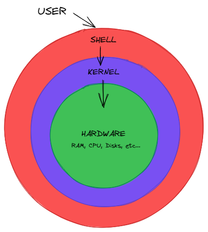

LIGNE DE COMMANDE: Apprendre les bases 1/6 - Introduction au terminal sous Linux
===

---

## Au début, il y a les OS

**OS (Operating System)** : Systèmes d'exploitation
Ensemble d'applicatifs qui dirige l'utilisation des ressources matérielles et logicielles d'un ordinateur.

---

## Les parties d'un OS

**Shell ("coque"):** Interface utilisateur du système.
**Kernel("noyau")**: Coeur du système. Gère les ressources de l'ordinateur

---

---

## Le shell

Se présente sous deux formes:
- **CLI ("Command Line Interface")** : Interface en ligne de commande, tout au clavier
- **GUI ("Graphic User Interface")**: Interface graphique utilisateur, à l'aide la souris.

---

---

## Bash, ZSH et Powershell

**Bash ("Bourne Again SHell")**: Langage de programmation spécifique au shell
Par défaut pour la plupart des systèmes Linux + Mac < juin 2019

**ZSH (Z shell)**:  Version étendue de bash (avec autocomplétion notamment)
Par défaut pour Mac > Juin 2019 (macOS Catalina)

**PowerShell**:  Equivalent de Bash pour Windows

La plupart des commandes de base ont une syntaxe commune.

---

## Le terminal

Sous Mac et Linux, le shell est accessible depuis une console que l'on nomme **Terminal**.
Sous Windows, la console se nomme **PowerShell**

---

 ## Mais au fait, pourquoi Linux?

Nommé aussi :  **GNU/Linux** (système GNU, noyau Linux de type UNIX)
https://www.linuxpedia.fr/lib/exe/fetch.php/gldt1108.png

- C'est gratuit et libre (donc open source)
- C'est léger, et certaines distributions peuvent fonctionner sur de vieilles machines
- Représente plus de 90% des OS sur serveur

---

##  Les façons d'utiliser Linux

- En multi boot
- **Dans une machine virtuelle**
- Sur un serveur

NB: Sur Windows, on peut installer un sous-système linux grâce à [WSL](https://docs.microsoft.com/fr-fr/windows/wsl/install)

---

## VirtualBox, le monitor

---

### Initialisation de VirtualBox

1. Télécharger VirtualBox [ici](https://www.virtualbox.org/wiki/Downloads) et l'installer
2. Redémarrer la machine

NB: Si en cliquant sur "Nouvelle", dans `Version`  que des choix en 32 bits
- Activer dans le BIOS la virtualisation (VT-x et VT-d pour les Intel x64, SVM pour AMD 64)
- Si Windows, désactiver l'Hyper-V dans les fonctionnalités

----

### Création d'une machine virtuelle Debian

1. **Version:** Debian (64-bit)
2. **Créer un disque dur virtuel maintenant**
3. Format **VDI (VirtualBox Disk Image)**
4. Espace disque **dynamiquement alloué**
5. Limite de taille à définir (prendre la recommandé)

---

## Installation de Debian

### Mise en place de l'ISO

1. Télécharger le le fichier d'installation iso sur [debian.org](https://www.debian.org/download)
2. Dans configuration de votre VM > Stockage > Contrôleur: IDE, charger l'iso.
3. Démarrer la VM
4. Choisir Graphical Install

---

### Les paramètres d'installation

https://debian-handbook.info/browse/fr-FR/stable/sect.installation-steps.html

1. La langue du système d'exploitation
2. La situation géographique (pour le fuseau horaire)
3. Le clavier (pour l'Azerty)
4. Le mot de passe du super utilisateur ("root")
5. Création d'un utilisateur normal avec son nom complet, identifiant et mot de passe

---

### Le partitionnement

Recommandé: **Assisté - utiliser un disque entier**
Puis: **Tout dans une seule partition (recommandé pour les débutants)**

Conseils pour partition séparées:
- une `/home` à part peut être utile dans le cas où ton système plante.
- un utilisateur normal peut provoquer une écriture problématique dans `/var`, et `/tmp`

---

### D'autres partitions utiles

- Le **swap**:  utilisé pour décharger la RAM de votre ordinateur lorsque celle-ci arrive à saturation
- La racine: `/` qui comprend tous les autres dossiers

---

## Environnement de bureau

Interface utilisateur sous la forme de bureau + menus

Il en existe plusieurs:
- **Gnome**
- XFCE
- KDE
- Mate
- etc...

---

## Le GRUB

**GRUB** (**GR**and **U**nified **B**ootloader): logiciel permettant de charger un système d'exploitation

---

## Quelques commandes BASH
 - `cat /etc/os-release`: donne des infos sur la version actuelle de l'OS
 - ``pwd`` : Renvoie le chemin du répertoire courant
 - `ls`: Liste les fichiers et dossier du répertoire courant
	 - Option `-a`: Liste les fichiers cachés aussi (Sur linux, un ``.`` devant le nom)
 - `man <unecommande>`: Donne le manuel d'explication de la commande

---

### Les infos BASH de base

Bash lit nos commandes ligne par ligne.
Chaque commande doit être terminée avant d'en exécuter une autre

`~`: Racine du dossier **Home**

**Ctrl+C** permet de **stopper une commande** avant la fin de son exécution