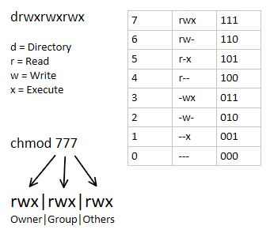

LIGNE DE COMMANDE: Apprendre les bases 3/6 - Les droits et permissions
===

---

## Les droits de super utilisateur

**sudo** (**s**ubstitute **u**ser **do** / **s**uper **u**ser **do**):
Faire en tant que super utilisateur

Agir en tant qu'administrateur temporaire du système

```bash
sudo ls
sudo nano
...
```

**NB: L'utilisateur doit au préalable faire partie du groupe sudo**

---


## Groupes et Utilisateurs

- **User**: Utilisateur actuel
- **Group**: Groupe d'utilisateurs

**Tout utilisateur a un ou plusieurs groupes**

```bash
groups
# Affiche les groupes de l'utilisateur actuel
# clark cdrom floppy audio dip video plugdev netdev bluetooth scanner
```

---

### Les lister

Utilisateurs: dans le fichier `/etc/passwd`
Groupes: dans le fichier `/etc/group`

```bash
cat /etc/passwd
cat /etc/group
```

---

### Les créer

**groupadd**: Créer un groupe
```bash
sudo groupadd geeks
```

**adduser**: Créer un utilisateur
```bash
sudo adduser <username>
```

**Attention! Commandes nécessitant les droits de super utilisateur**

---

### Les lier entre eux

**Ajouter un utilisateur à un groupe:**
```bash
# Ajouter clark au groupe sudo
sudo adduser clark sudo
sudo usermod -aG clark sudo
```

**Supprimer un utilisateur d'un groupe:**
```bash
# Supprimer clark du groupe geeks
sudo deluser clark geeks
sudo gpasswd -d clark geeks
```

---


### Les supprimer

**Supprimer un utilisateur:**
```bash
sudo deluser lois

# ! supprimer  son répertoire personnel
sudo rm -R /home/lois
```

**Supprimer un groupe:**
```bash
sudo groupdel geeks
```

---

## Changer d'utilisateur

**su** (**s**witch **u**ser): Switcher d'utilisateur
- `-` force le redémarrage d'un nouveau shell de connexion
- Sans option, `su -` se connecte à l'utilisateur root

```bash
su -
# root@debian:~#
```

---

## Modification du mot de passe

**passwd**: Changer le mot de passe d'un utilisateur

```bash
passwd # Change mdp utilisateur courant
sudo passwd lois # Change mdp lois
```


---

## Les permissions

Chaque élément du système est basé sur un profil de 3 types d’autorisation(RWX)


**R** (**R**ead): Lecture
**W** (**W**rite): Ecriture
**X** (e**X**ecute): Exécution (si script)


---

### Pour les fichiers

- Lecture (**r**) : lire le fichier avec un logiciel.
- Écriture (**w**) : modifier le fichier et le vider de son contenu.
- Exécution (**x**) : exécuter le fichier s'il est prévu pour (comme un programme)

---

### Pour les dossiers

- Lecture (**r**) : il autorise l'affichage du contenu du répertoire (la liste des fichiers présents à la racine de ce répertoire).
- Écriture (**w**) : autorise la création, la suppression et le changement de nom des fichiers qu'il contient, quels que soient les droits d'accès des fichiers de ce répertoire
- Exécution (**x**) : autorise de traverser le répertoire.

---

### Exemple de permissions

```bash
r-x fichier # peut être lu et exécuté, mais pas être modifié.
rw- fichier # peut être lu ou modifié, mais pas être exécuté.
--- fichier # ne peut pas être lu, modifié ni même exécuté.
```


`–` : Utilisé à la place d’une lettre pour indiquer que la permission n’est pas accordée.

---

###  Voir les permissions
grâce à la commande `ls -l`

```bash
# ls -l
drwxr-xr-x 6 clark geeks 4096 déc.   8 12:32 dossier
-rwxr-xr-x 6 clark geeks 4096 déc.   8 12:32 fichier.txt
```

Premier symbole:
- `-` pour fichier
- `d` pour dossier

---

### Décryptage


- Propriétaire: Utilisateur propriétaire (**u**)
- Groupe: Groupe d'utilisateurs en possession du fichiers (**g**)
- Others: Tous les autres utilisateurs  (**o**)
- All: Tous (**ugo** ou **a**)


---


## Changer des permissions

NB: Seuls root et le propriétaire du fichier le peuvent

### Pour l'utilisateur propriétaire

**En ajouter**:
```bash
chmod +r <fichier>
chmod +wx <fichier>
```

**En supprimer**:
```bash
chmod -rw <fichier>
chmod -x <fichier>
```

---

### Pour le groupe propriétaire

Ajouter la lettre `g` avant

```bash
chmod g+w <fichier>
chmod g-r <fichier>
```

### Pour les autres

Ajouter la lettre `o` avant

```bash
chmod o+x <fichier>
chmod o=rw <fichier>
```

---

### Pour plusieurs catégories

Les lettres s'additionnent
```bash
chmod ugo+rw <folder>
# équivalent à
chmod a+rw <folder>
```

### De manière récursive

```bash
# Sur tous les fichiers et dossiers compris dans un dossier parent
chmod +x -R <dossier>
````

---

### Par valeurs octales



---

## Changer le propriétaire

Grâce à la commande `chown`


```bash
# Changer le User
chown luke <fichier>
chown leia -R <dossier>

# Changer le group
chown :geeks <fichier>

# Changer le user et le group
chown luke:jedi <fichier>
```